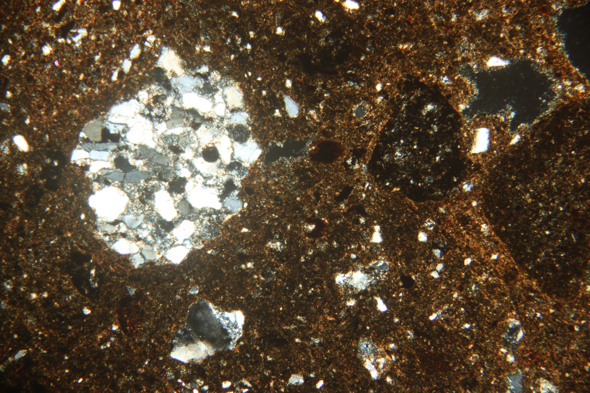
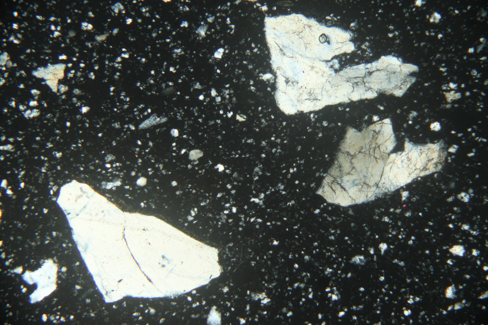

```{r, setup, echo=FALSE, include=FALSE}
library(tidyverse)
library(readxl)
library(ggbeeswarm)
library(car)
library(knitr)
```

## Introduction
In order to examine the ceramic paste of locally made pottery from Kiwulan site, I sampled 33 ceramic fragments from 15 different pits to make thin sections for petrographic analysis. This analysis will be helpful to understand two things. First, I should be able to look at changes in the ceramic paste over time.  If there is a development of ceramic specialization due to the control under particular individuals, then the production of pottery will show more homogenous features among different households after European contact. In addition to the shape of pottery, the ceramic paste, such as inclusion, might also reflect the homogenous pattern. Second, this analysis could also provide some information to re-examine the previous principle of pottery classification. Based on the excavation report, there is only one type of pottery in the upper layer culture according to the property of pottery.

##Sampling strategy
Ideally, 2 sherds, one from pre-contact period and another one from contact or post-contact periods should be sampled from each pit to make a comparison. Given that the amount of sherds the Ilan culture center could provide is limited and different condition of each fragment, for those pits with only one suitable sherd, I pick up another sherd from the adjacent pit with similar archaeological context. Beside, detailed examination of chronology related to European contact period for some pits have not been done yet, but sherd samples still could be selected according to altitude and arbitrary level applied to those pits. The detailed examination of European contact period will be done later.         

The pits where the samples come from are distributed evenly across the central area of the site, which covers different possible households according to the evidence of postholes (Figure 1). These postholes with in-situ posts were found aligned in a north-south direction, which were interpreted as the remains of house structures. The red zone is my research area, and the blue areas are the sampling pits. This enables the comparison between different households. 

```{r, fig.cap = "Figure 1: Smampling area", out.width= "400px", echo=FALSE}
include_graphics("../figures/sample area_2.JPG")
```

##  Sherd description
Most sherds are fired to an orange to brownish color with a fully oxidized core or a reduced core with oxidized fringes. Predominant Munsell colors are: 7.5 YR 6/2(grayish brown), 5 YR 6/4 (orange), 7.5 YR 5/2(brownish gray), and 5 YR 6/2(greyish brown). It seems that there is no significant relationship between color and time period. The composition of inclusions is characterized by predominance of fine and mainly gray to black inclusions, which might be argillite according to the geographic condition of the Ilan Plain. The proportion of inclusion for most sherds is around 35-50%, although some might have less inclusion.  The thickness of sherds is between 2 and 8mm and most of them ranges from 3 to 5mm. The box plot shows that sherds from contact period might be thicker than another two periods. But overall the difference is not significant. (How to make the time period in the order?)

```{r, echo=FALSE, warning=FALSE}
# read data
kwl_th <- read_excel("../data/Patrography.xlsx", 2)
kwl_sh <- read_excel("../data/Patrography.xlsx", 1)
```

```{r, echo=FALSE, results='hide'}
# have a look
str(kwl_sh)
str(kwl_th)
```

```{r, echo=FALSE, results='hide'}
#some tables wtih sum
color <- addmargins(table(kwl_sh$color,kwl_sh$new_layer), 2)
color
core <- addmargins(table(kwl_sh$firing_core,kwl_sh$new_layer), 2)
core
```

```{r, echo=FALSE, warning=FALSE}
# get the mean of the thick of body
kwl_sh$thick_ave <- rowMeans(subset(kwl_sh, select = c(thick_body1, thick_body2)), na.rm = TRUE)

# distributions of the thick of body by time period
ggplot(kwl_sh,
       aes(new_layer, thick_ave)) +
  geom_boxplot() +
  geom_quasirandom() +
  theme_minimal()
```

## Thin section
The examination of thin sections is conducted at the Department of Geosciences of National Taiwan University under the supervision of Prof. Wen-Shan Chen. Within the thin sections we can see a high percentage of inclusions (15-50%), which contains argillite, quartz, feldspar, metasandstone, sandstone fragment, and slate. Reddish-brown nodules could be observed in some thin sections, which might be FeMn nodules, but the real composition should be further examined. Besides, argillites within some thin sections present reddish brown color, which might be affected by weathering.    According to the result of the principle component analysis, the thin sections could be further divided into three types. 

#####First type:
The first type, also the dominant one, has a high percentage of inclusion (25-40%), which is composed mainly by argillite (15-40%), followed by metasandstone (1-10%), sandstone (1-6%), and quartz (1-5%). The size of the particles ranges from 500 micron to 1300 micron (=1 mm). Overall, this type presents a mixture of fine, rounded argillite with a small part of rounded metasandstone and rounded to sub-angular monocrystalline quartz.  

```{r, fig.cap = "Type 1", out.width= "400px", echo=FALSE}
include_graphics("../figures/kwl16_2o_40x.JPG")
```

#####Second type: 
This type includes No. 1,2,5,11,17. The percentage of inclusion is around 30-45%, which is composed by argillite (10-25%), metasandstone (5-10%), quartz (5-10%), sandstone (0-5%). Besides, one thin section of this type has a higher percentage of slate (12.5%). The size of the particles ranges from 500 micron to 1000 micron. The shape of the majority of inclusions is rounded, except for some sub-angular quartz.  

```{r, fig.cap = "Type 2", out.width= "400px", echo=FALSE}

```

#####Third type: 
This type includes No. 31 and No.27. The percentage of inclusion is around 15-25%, which is mainly composed by quartz (9-12%) and metasandstone (0-5%). The size of the particles ranges from 500 micron to 1500 micron. The shape of most quartz is angular, which might indicate the source of clay is from upstream location.  

```{r, fig.cap = "Type 3", out.width= "400px", echo=FALSE}

```

```{r, echo=FALSE}
# sum the columns of similar minerals
kwl_th$Quartz <- rowSums(subset(kwl_th, select = c('Monocrystalline quartz', 'Polycrystalline quartz')), na.rm = TRUE)
kwl_th$Argillite_2 <- rowSums(subset(kwl_th, select = c('Argillite', 'Reddish-brown Argillite')), na.rm = TRUE)
```

```{r, echo=FALSE}
# summary of proporstion of inclusion
inc <- summary(kwl_th$Matrix)
inc
arg <- summary(kwl_th$Argillite_2)
arg
meta <- summary(kwl_th$Metasandstone)
meta
sand <- summary(kwl_th$Sandstone)
sand
qrz <- summary(kwl_th$Quartz)
qrz
```

```{r, echo=FALSE,results='hide'}
# extract specific column
kwl_pca <- kwl_th[,c(4,5,8,9,10,11,12,17,18)]

# PCA 
pca1 <- prcomp(kwl_pca, scale. = TRUE)
# sqrt of eigenvalues
pca1$sdev
# loadings
head(pca1$rotation)
# PCs (aka scores)
head(pca1$x)
```

```{r, echo=FALSE}
# load ggplot2
library(ggplot2)

# create data frame with scores
scores = as.data.frame(pca1$x)

# plot of observations
ggplot(data = scores, aes(x = PC1, y = PC2, label = rownames(scores))) +
  geom_hline(yintercept = 0, colour = "gray65") +
  geom_vline(xintercept = 0, colour = "gray65") +
  geom_text(colour = "tomato", alpha = 0.8, size = 4) +
  ggtitle("PCA plot of thin sections - Mineral")
```

##Discussion
Since the proportion of major minerals, including argillite, metasandstone and quartz, could be used to identify different types, the next step is to figure out the relationship between types and time periods. The byplot of argillite and quartz suggests that the thin sections from pre-contact period have less proportion of quartz compared with other two periods. Moreover, the thin sections from post contact period show the bigger range of the proportion of quartz. For another byplot of argillite and metasandstone, it seems that there is no big difference among different time periods. 

```{r, echo=FALSE, warning=FALSE}
# convex hulls for time periods by argillite and quartz
kwl_th_hulls <- 
kwl_th %>% 
  filter(!is.na(Quartz), !is.na(Argillite_2)) %>% 
  nest(-new_layer) %>% 
  mutate(hulls = map(data, ~.[chull(.$Quartz, .$Argillite_2),])) %>% 
  select(new_layer, hulls) %>% 
  unnest(hulls)

ggplot(kwl_th,
       aes(Quartz,
           Argillite_2, 
           colour = new_layer,
           fill = new_layer)) +
  geom_point() +
  geom_polygon(data = kwl_th_hulls, 
               alpha = 0.1, 
               color  = NA) +
  theme_minimal()
```

```{r, echo=FALSE, warning=FALSE}
# convex hulls for time periods by argillite and metasandstone
kwl_th_hulls2 <- 
kwl_th %>% 
  filter(!is.na(Metasandstone), !is.na(Argillite_2)) %>% 
  nest(-new_layer) %>% 
  mutate(hulls = map(data, ~.[chull(.$Metasandstone, .$Argillite_2),])) %>% 
  select(new_layer, hulls) %>% 
  unnest(hulls)

ggplot(kwl_th,
       aes(Metasandstone,
           Argillite_2, 
           colour = new_layer,
           fill = new_layer)) +
  geom_point() +
  geom_polygon(data = kwl_th_hulls2, 
               alpha = 0.1, 
               color  = NA) +
  theme_minimal()
```

##Conclusion
To sum up, the thin sections examined in this preliminary study shows different kinds of types. According to the result of byplot, it seems that the inclusion shows more homogenous feature in the pre contact period, which contradicted my original argument. It might indicate that the control of ceramic production does not involve in the source of clay, or there is no control of ceramic production after European contact. It is also possible that those special types could be related to trade goods, which have different source from local community. For example, the No. 31 (type 3) has larger thickness compared to other sherds, which is different from the dominant pottery type in the Upper layer culture. To have a comprehensive understanding, further research about the time period for the rest of thin sections and the spatial correlation should be done. Also, the results should be discussed with the shape analysis of complete pots in the future.          